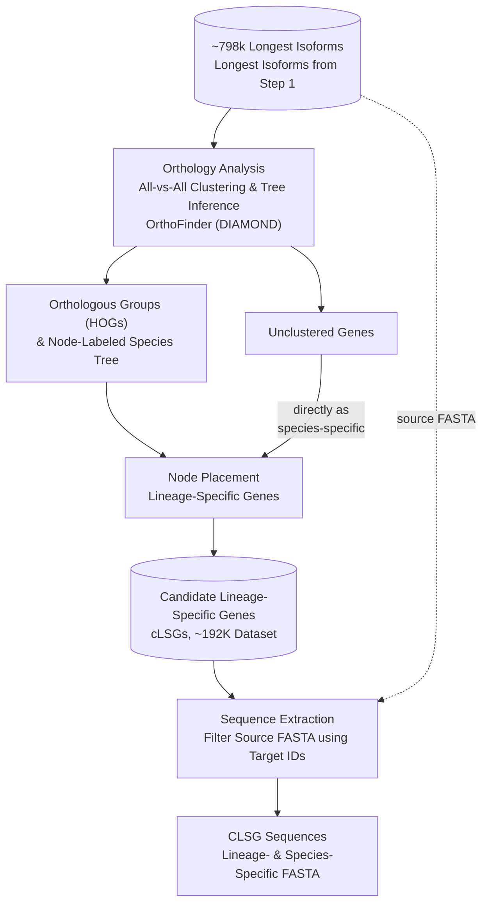

# Gene Stratigraphy Pipeline

A pipeline for stratifying genes by phylogenetic depth of origin, using OrthoFinder's Hierarchical Orthogroups (HOG) output across a rooted species tree. For each focal species, every gene is assigned to the tree node at which its orthogroup first appears — from deeply conserved (shared with distant relatives) down to apparently private to that species alone (a candidate lineage-specific gene, or cLSG).

This is not an orthology inference tool. OrthoFinder does that. This tool consumes OrthoFinder's output and organizes it into a phylogenetically resolved layering — a stratigraphy — of a species' gene content.

## Pipeline overview



## What stratigraphy is useful for

- **Prioritizing candidates for de novo gene (DNG) identification.** Manually inspecting every gene in a proteome for evidence of lineage-specific or de novo origin is not tractable. Stratigraphy narrows a whole proteome down to the genes actually worth deeper scrutiny — phylogenetic placement, synteny, ORF-emergence tracing — instead of starting from everything.
- **A phylogenetically resolved view of gene content**, useful beyond DNG work: gene family turnover, lineage-specific expansions, and comparative genomics questions about which genes are conserved versus restricted to a given clade.
- **Genuinely multi-species, not pairwise.** Many gene-stratigraphy-style analyses compare one species against one reference at a time, typically via BLAST. This pipeline classifies each gene against an entire rooted species tree at once, using OrthoFinder's hierarchical orthogroups rather than pairwise best-hit search — a gene's stratigraphic placement reflects its relationship to every species in the tree simultaneously, not just whichever one it happened to be compared against.
- **A fast, repeatable first pass**, not a final answer. OrthoFinder's HOG-based clustering can miss real relationships — a gene can look species-specific purely because the specific hierarchical level examined structurally cannot see every other species (see the cross-check documentation below). Every output here is a *candidate*, meant to be filtered further before being treated as biologically real.

## Role in LINGUA

This is Stage 2 of the LINGUA comparative genomics framework:

1. Dataset curation (Stage 1 — protein preprocessing and isoform selection)
2. **Gene stratigraphy (this repository)** — orthology-based classification of genes by phylogenetic depth, producing candidate lineage-specific genes
3. Homolog exclusion (removal of false positives from the candidate list)
4. Synteny validation (genome alignment-based validation)

The candidate list this stage produces is deliberately over-inclusive rather than under-inclusive — Stage 3 and Stage 4 exist specifically to filter it further. Nothing coming out of this stage should be treated as a confirmed lineage-specific or de novo gene on its own.

## Requirements

- bash
- Python 3.7 or later
- [OrthoFinder](https://github.com/davidemms/OrthoFinder) installed and on `PATH` (for the generation step only — the classification step only reads OrthoFinder's output files, it doesn't call OrthoFinder itself)

No third-party Python dependencies; everything here is standard library.

### Installing OrthoFinder (conda, recommended)

```bash
conda config --add channels defaults
conda config --add channels bioconda
conda config --add channels conda-forge
```

Close and reopen your terminal so the channel changes take effect, then:

```bash
conda create -n orthofinder
conda activate orthofinder
conda install orthofinder
```

Confirm it's on `PATH`: `orthofinder -h`. See OrthoFinder's own [installation tutorial](https://davidemms.github.io/orthofinder_tutorials/alternative-ways-of-getting-OrthoFinder.html) for alternatives (Docker, source install) if conda isn't an option in your environment.

## Getting the pipeline

```bash
git clone https://github.com/Ludtson/gene-stratigraphy-pipeline.git
cd gene-stratigraphy-pipeline
```

## Two separate stages: generation and classification

Running OrthoFinder and classifying its output are kept as two separate commands, not one combined pipeline. OrthoFinder itself is the expensive part — many CPUs, long walltime, usually an HPC batch job — while classification is lightweight and gets iterated on far more often than the OrthoFinder run itself needs to be repeated. Keeping them separate means changing or re-running the classification logic never requires re-running OrthoFinder.

### 1. Generation: `scripts/run_orthofinder.sh`

Runs OrthoFinder (DIAMOND-based) on a directory of protein FASTA files, with optional species renaming and an optional pre-computed rooted species tree.

```bash
bash scripts/run_orthofinder.sh \
  -i step1_output \
  -o step2_output \
  -t 16
```

See `bash scripts/run_orthofinder.sh -h` for the full option list (`-m` for a species map file, `-s` for a rooted species tree).

### 2. Classification: `bin/OrthoFinderDataProcessor.py`

Reads OrthoFinder's results and produces the stratified candidate lineage-specific gene lists.

```bash
python bin/OrthoFinderDataProcessor.py output_dir \
  --orthofinder_dir step2_output/orthofinder \
  --prt_dir step2_output/protein
```

**`--prt_dir` must point at `step2_output/protein` (the copy `run_orthofinder.sh` made), not Step 1's own output directory.** Unclustered-gene detection looks up each species' protein FASTA by the exact species name OrthoFinder used internally (e.g. `C_cavernarum.faa`) directly under `--prt_dir` — no suffix handling, no species-map fallback for this lookup. `run_orthofinder.sh`'s `protein/` subdirectory always has that clean name already, because that's the same copy it fed to OrthoFinder (stripping Step 1's fixed `<species>_final.faa` naming convention when no map file is given — see `run_orthofinder.sh -h`). Step 1's raw output directory generally won't match, and a mismatch fails silently: a logged warning per species, not a crash, but unclustered genes for that species go undetected.

Key options:

- `--hog-filename` (default `N0.tsv`) — which hierarchical orthogroup file to classify from. See "Why `--hog-filename` might not be `N0.tsv`" below before assuming the default is right for your run.
- `--orthogroups-filename` / `--orthologues-dirname` — inputs for the mandatory cross-check (see below); both are auto-located the same way every other required file is, so these rarely need to be set manually.
- `--skip-cross-check` — explicitly disables the cross-check. Only use this if you understand the consequence (see below).
- `--species-map` — optional CSV/TSV with `Species`/`Basename` columns to rename files to full species names in the output.

## Why `--hog-filename` might not be `N0.tsv`

OrthoFinder's Hierarchical Orthogroups (`Phylogenetic_Hierarchical_Orthogroups/N0.tsv`, `N1.tsv`, ...) represent orthogroups at every node of the species tree, not just the root. Per OrthoFinder's own documentation: *"If outgroup species are used, refer to `Species_Tree/SpeciesTree_rooted_node_labels.txt` to determine which N?.tsv file that contains the orthogroups you require."*

Two situations where the file you want isn't `N0.tsv`:

- **An outgroup was added deliberately** — e.g. because the OrthoFinder version in use doesn't emit `N0.tsv` for the ingroup of interest, so an extra outgroup species is included specifically to push the true root out one level, making the ingroup's root-level HOGs appear in `N1.tsv` instead. Confirm which file is correct by checking `SpeciesTree_rooted_node_labels.txt` directly — don't assume.
- **A shallower node is of interest on purpose** — e.g. asking a within-genus question rather than a whole-species-tree question.

Either way, `--hog-filename` is a normal, fully overridable argument: point it at `N1.tsv`, `N2.tsv`, or any `Nk.tsv`.

**Whichever file is used, every species outside that node's clade is structurally invisible to classification.** This isn't specific to an "outgroup" as a special case — it's true of any species outside the chosen node, for any reason the file was chosen. That's exactly what the mandatory cross-check below exists to catch.

## The mandatory cross-check

A gene can look like a candidate lineage-specific gene purely because the HOG file in use cannot see the species it actually has a relationship with — not because it's genuinely unique. `OrthologyCrossChecker` (`bin/OrthologyCrossChecker.py`) verifies every candidate against two other OrthoFinder outputs before it's treated as final:

1. **Primary: `Orthogroups.tsv`** — OrthoFinder's flat, whole-dataset clustering. Unlike the HOG files, this always includes every species OrthoFinder was run on, including any outgroup. If a candidate's Orthogroup contains any other species, it's excluded.
2. **Secondary: pairwise `Orthologues/Orthologues_<species>/*.tsv`** — reciprocal-best-hit, tree-refined. Checked only for candidates that survive the primary pass, as a higher-precision second opinion.

Every exclusion is logged (`cross_check_exclusions.tsv`: gene ID, original classification, which check caught it, which species/gene it conflicted with) — auditable, not silent. This is mandatory by default; `--skip-cross-check` is the explicit opt-out if the inputs genuinely aren't available.

`c_lsg_summary.csv`/`global_summary.csv` report `total_candidate_percentage` (before the cross-check) and `verified_candidate_percentage` (after) side by side, so the effect of the cross-check is directly visible per species, not hidden behind a single changed number.

## Verifying results independently

`bin/CLSGClassificationVerifier.py` re-derives ground truth directly from the HOG table, from scratch — it does not reuse any other class in this pipeline, so a shared bug can't silently cancel out and hide a real error. It checks that every "clustered" candidate's HOG really is private to that species, and every "unclustered" candidate really is absent from the HOG table entirely.

```bash
python bin/CLSGClassificationVerifier.py \
  --hog-tsv path/to/N1.tsv \
  --results-dir output_dir \
  --report violations_report.tsv
```

Exits non-zero if any violation is found, so it can be used as a CI gate, not just a manual report.

## Output structure

```
output_dir/
  <species>/
    gene_IDs_by_node/       # gene IDs per phylogenetic node, plus the final candidate_lsg list
    HOG_IDs_by_node/        # HOG IDs per phylogenetic node
    proteins_by_node/       # candidate cLSG protein FASTA
    <species>_summary_per_node.csv
  intermediate/              # SpeciesStats.csv, c_lsg_summary.csv, global_gene_counts_per_node.tsv
  C_LSG_Iso.tsv               # every gene, every species, one row each
  global_summary.csv          # canonical master table (merges the intermediate/ files)
  cross_check_exclusions.tsv  # audit log of every cross-check exclusion
  OrthoFinderDataProcessor.log
```

## Components (`bin/`)

- `OrthoFinderDataProcessor.py` — orchestrates classification for every species
- `OrthoFinderN0GeneSorter.py` — parses the HOG table into a queryable species/HOG/gene structure
- `OrthoFinderTreeParser.py` — parses the rooted species tree, walks ancestry
- `OrthologyCrossChecker.py` — the mandatory `Orthogroups.tsv`/pairwise-Orthologues cross-check
- `CLSGClassificationVerifier.py` — independent, from-scratch verification against the HOG table
- `OrthoFinderStatsProcessor.py` — converts OrthoFinder's per-species stats to CSV
- `CSVFileMerger.py` — merges the intermediate tables into the master table
- `FastaGeneFilter.py` — extracts a gene-ID subset from a FASTA file

## Contributing

See [CONTRIBUTING.md](CONTRIBUTING.md) for how to run the reproducibility check against `example_data/`, coding style expectations, and the pull request process.

## Citation

If you use this pipeline, please cite it via [CITATION.cff](CITATION.cff) (GitHub also surfaces this as a "Cite this repository" option on the repo page).

## License

MIT License. See [LICENSE](LICENSE).

## Acknowledgements

Casola Lab, Ecology & Conservation Biology Program, Texas A&M University.

