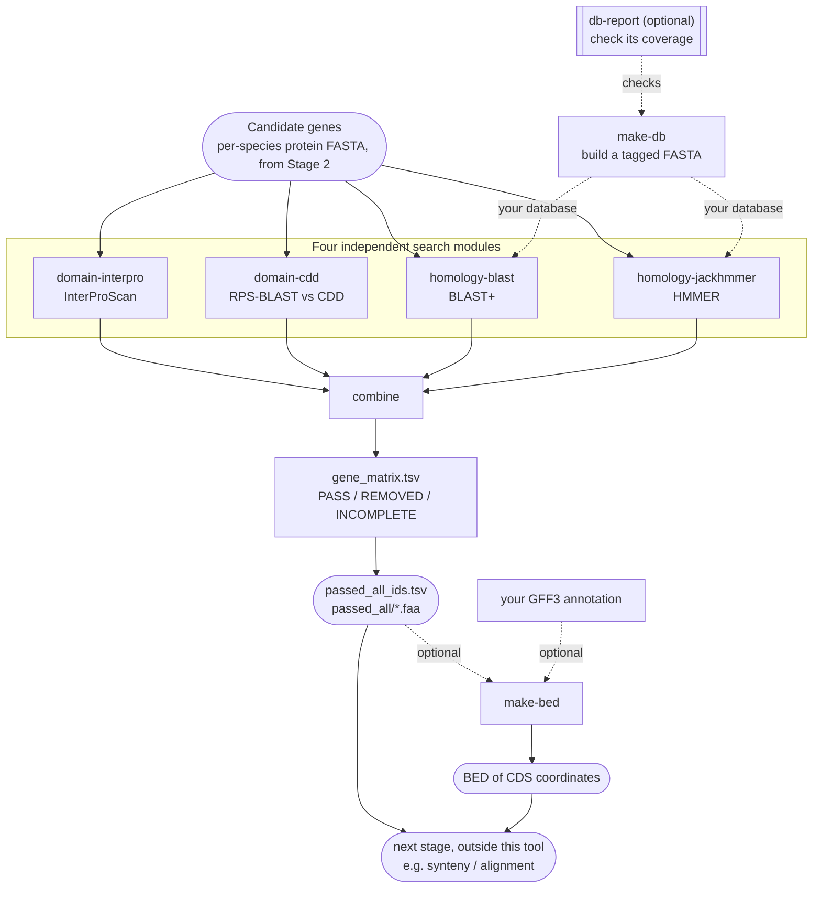

# Workflows

Every module runs on its own. You can run them all on the same input and merge the results, or chain them so each one searches only
what the previous one passed. Both end with `combine`.



In the examples below, `T` stands for the entry script:

```bash
T="bash scripts/homolog_exclusion_pipeline.sh"
```

Your input is a folder with one protein FASTA per species (the candidate genes from Stage 2), for example `candidates/`. The species
is the file name without its extension and without `_final`; `--species-map` gives full names.

## Species names and the species map

The modules exempt hits to your own analysis species, so they need to know their names. By default a species is the input file name
without its extension and without `_final`. If your files are named by code (for example `Athaliana.faa`), or you want full names
(`Arabidopsis thaliana`) so that subspecies and strains match correctly, give `--species-map FILE`: two columns, **species name**
then **file name without its extension** (keep `_final` if the file has it), a header row, tab- or comma-separated, as Stage 1 writes:

```
Species	Basename
Arabidopsis thaliana	Athaliana
Brassica rapa	BrapaFPsc
```

The same file works for `make-db --exclude-inputs`, `db-report --clade-inputs` and every search module.

## 1. Everything on every gene, then merge

Each run searches every gene. Use it when you want to see how the searches differ (which genes only the sensitive search removes).

```bash
$T domain-interpro     -i candidates/ -o out/interpro  --label interpro
$T domain-cdd          -i candidates/ -o out/cdd       --label cdd      --db data/cdd/Cdd
$T homology-blast      -i candidates/ -o out/blast     --label blast    --db db/mosses.faa
$T homology-jackhmmer  -i candidates/ -o out/jackhmmer --label jackhmmer --db db/mosses.faa
$T combine --runs out/interpro out/cdd out/blast out/jackhmmer -o out/combine
```

## 2. Iterative: drop genes as you go

Each run writes its survivors to `passed/<species>.faa`. Give that folder to the next run. A gene removed early is never searched by
the later, slower runs. Put the cheap or most-productive searches first.

```bash
$T domain-cdd          -i candidates/        -o out/1_cdd       --label cdd      --db data/cdd/Cdd
$T homology-blast      -i out/1_cdd/passed   -o out/2_blast     --label blast    --db db/mosses.faa
$T homology-jackhmmer  -i out/2_blast/passed -o out/3_jackhmmer --label jackhmmer --db db/mosses.faa
$T combine --runs out/1_cdd out/2_blast out/3_jackhmmer -o out/combine
```

List the runs in `combine` **in the order you made them**. Genes an earlier run removed show as `NOT_SEARCHED` in the later columns,
with `dropped_by` naming the run (see `docs/combine.md`). Measured on real data (network cut off): 200 proteins went through `domain-cdd`,
then `blastp`, then `jackhmmer` on each step's survivors in 51 seconds in total (162, 25 and 1 genes removed; 12 passed);
`jackhmmer` alone on all 200 took about 37 minutes.

## 3. Several databases, in order

Repeat `--db`. By default each database searches every gene as its own labelled run (`out/<database>/`). Add `--sequential` and each
searches only the genes the previous one passed. If a database fails, the chain stops and says which databases were not searched.

```bash
$T homology-blast -i candidates/ -o out/blast --sequential \
    --db db/close_relatives.faa --db db/plants.faa --db db/fungi.faa --db db/animals.faa --db db/prokaryotes.faa
$T combine --runs out/blast -o out/combine        # a folder of run folders is read in chain order
```

Put the databases most likely to hit first. `docs/databases.md` explains how to design them.

## 4. The organelle screen

A nucleotide database of organelle genomes, searched with `tblastn`, and its own label so it is its own column:

```bash
$T homology-blast -i candidates/ -o out/organelle --label organelle \
    --db db/organelle_genomes.fna --config presets/organelle_tblastn.conf
```

## 5. Build a database first

```bash
$T make-db -i per_species_proteomes/ -o db/mosses.faa --exclude-inputs candidates/
$T db-report --db db/mosses.faa --clade-inputs candidates/ --taxonomy taxonomy/ -o report/     # optional check
```

## 6. Search elsewhere, filter here

If a search ran on a cluster, or you already have the raw results, skip the search and re-apply the rules, with any settings:

```bash
$T domain-cdd -i candidates/ -o out/cdd --label cdd --parse-only cluster_results/ --min-domain-cov 70
```

Each module's page says which files the folder must hold (`docs/domain-cdd.md`, `docs/domain-interpro.md`,
`docs/homology-blast.md`, `docs/homology-jackhmmer.md`). A results file that does not show the search finished is not trusted: its
genes are `NOT_RUN`, not `NO_HIT`.

## Running, stopping and repeating

- An output folder is never overwritten by accident. Running again into the same folder is refused; `--resume` continues an
  interrupted run, `--force` overwrites its results, and a folder the tool did not make is always refused.
- `--print-config` prints the settings a run would use, without running.
- `--keep-work` keeps the scratch folder (chunks and logs); otherwise it is removed at the end.
- `--quiet` silences the end-of-run note (it is also written to `citations.txt`).
- **Exit status 2** means the run finished but some genes are `NOT_RUN` (for `combine`: `INCOMPLETE`): the results are written, those
  genes do not pass, and a script stops rather than pass partial results on. Re-run with `--resume`. Exit status 1 is an error; 0 is a
  clean run (`docs/interpreting_hits.md`).
- Check your installation first with `$T check` (see `docs/setup.md`).
